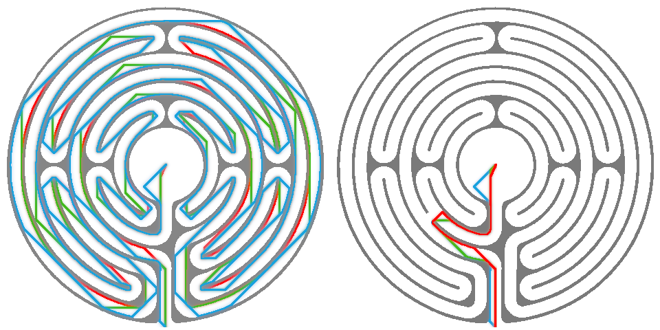

## Tiralabyra: Testaus

### Toteutus

Yksikkötestaus tapahtuu JUnit-testeillä. Myös kokonaisen
labyrintin ratkaisemista testataan testikuvien avulla. Testikattavuutta
seurataan Jacocon avulla sekä Eclipse IDE:n omalla kattavuusraportoinnilla.

Testausta on myös yksikkötestien ulkopuolella, sillä pääohjelma voi kutsua
eri algoritmien suoritusaikoja vertailevaa funktiota.

### Tuloksia

Vertasin kolmea eri algoritmia labyrinttien ratkaisuun: Dijkstraa, A*:ia ja
leveyshakua. Vertailussa käytin kahta hieman erilaista labyrinttiä, joista
ensimmäinen oli pitkä, kiemurteleva reitti joka ei kuitenkaan suuressa
mittakaavassa haarautunut. Toinen labyrintti oli sellainen muunnelma
edellisestä, jossa yksi seinä oli avattu ja näin reitti haarautuikin
useisiin suuntiin. Samalla lyhin mahdollinen reitti lyheni.

Kuviin on piirretty punaisella A*, sinisellä BFS ja vihreällä Dijkstra.
Ratkaisujen pituuden eroavat jonkin verran, mutta enemmän eroa on algoritmien
käyttämissä suoritusajoissa sekä läpikäytyjen solmujen määrässä.

Pitkä labyrintti:

|         | Aika   | Pituus  | Solmuja  |
|---------|--------|---------|----------|
|Dijkstra | 67 ms  | 6642    | 186 385  |
|A*       | 88 ms  | 6648    | 182 426  |
|BFS      | 43 ms  | 6848    | 187 200  |

A* siis kävi vähiten solmuja läpi, kuten oli odotettavissa. Nopeiten kuitenkin
suoriutui BFS. Tämä yllättävä tulos liittynee siihen, että jonototeutukseni käyttää
ympyrätaulukkoa, jolloin poistaminen ja lisääminen ovat O(1)-operaatioita.
Parhaan reitin sen sijaan löysi Dijkstra. Tämä tapahtui luultavasti siksi, että
suoraa diagonaalietäisyyttä mittaava heuristiikka sopii huonosti tällaiseen
polkuun.

Nyt lyhyt labyrintti:

|         | Aika   | Pituus  | Solmuja  |
|---------|--------|---------|----------|
|Dijkstra | 19 ms  | 399     | 48 811   |
|A*       | 7 ms   | 409     | 15 467   |
|BFS      | 12 ms  | 422     | 50 653   |

A* on selkeästi paras algoritmi tällaisen haaraumia sisältävän labyrintin ratkomiseen.